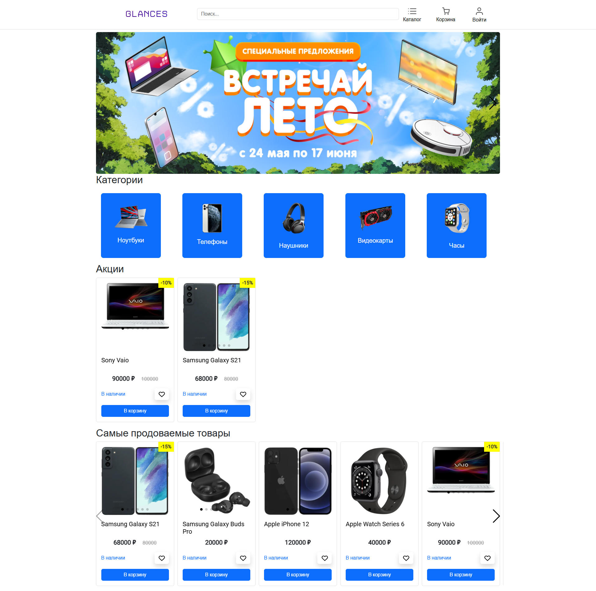
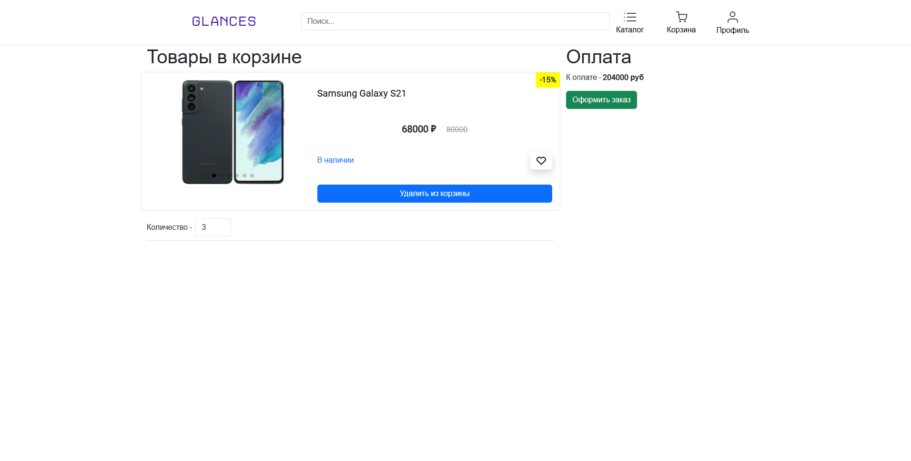
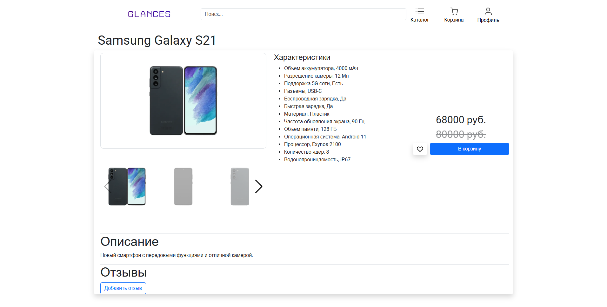
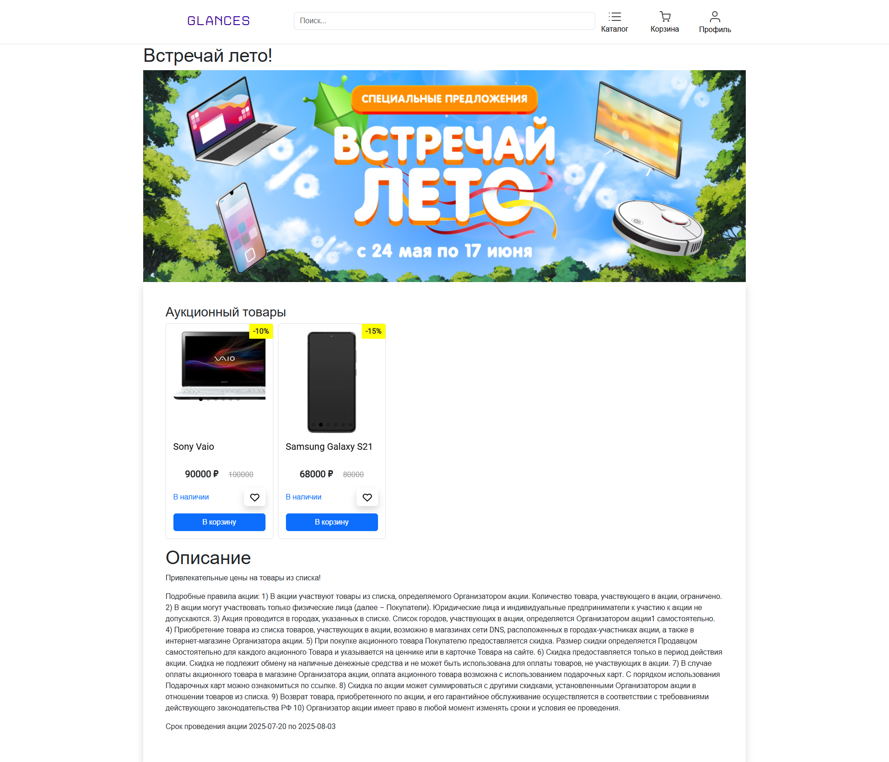

---

# Интернет-магазин электроники

## Содержание

1. [Описание проекта](#описание-проекта)
2. [Стек технологий](#стек-технологий)
3. [Возможности](#возможности)
4. [Установка и запуск](#установка-и-запуск)
5. [Структура проекта](#структура-проекта)
6. [Скрипты npm](#скрипты-npm)
7. [Вклад в проект](#вклад-в-проект)
8. [Лицензия](#лицензия)
9. [Примечания](#примечания)


## Описание проекта

Этот проект представляет собой интернет-магазин электроники, разработанный с использованием Spring Boot на стороне сервера и Vue.js на стороне клиента. Магазин предоставляет пользователям возможность просматривать, искать и покупать разнообразные электронные товары. Администраторы могут управлять товарами, категориями и акциями.

## Стек технологий

### Backend:
- Java
- Spring Boot
- Spring Data JPA
- Spring Security
- Hibernate
- PostgreSQL
- Flyway
- JWT

### Frontend:
- Vue.js
- Vue Router
- Axios
- Bootstrap
- Pinia

### Инфраструктура:
- Docker
- Nginx

## Возможности

### Пользователь:
- Просмотр товаров
- Поиск товаров по категории и названию
- Просмотр детальной информации о товаре
- Добавление товаров в корзину
- Оформление заказа
- Просмотр истории заказов

### Администратор:
- Управление товарами (добавление, редактирование, удаление)
- Управление категориями товаров
- Создание и управление акциями и скидками
- Просмотр списка заказов

## Установка и запуск

### Требования
- Docker
- Docker Compose

### Шаги для запуска проекта

1. **Клонирование репозитория:**
   ```sh
   git clone https://github.com/faketri/OnlineMarket.git
   cd OnlineMarket
   ```

2. **Настройка окружения:**
   Создайте файл `.env` в корневой директории и добавьте следующие переменные:
   ```env
    DB_CONNECT=jdbc:postgresql://postgres/postgres
   
    POSTGRES_USER=postgres
    POSTGRES_PASSWORD=your_password
    PGADMIN_DEFAULT_EMAIL=your_email
    PGADMIN_DEFAULT_PASSWORD=your_password
   
    JWT_ACCESS_KEY=your_jwt_access
    JWT_REFRESH_KEY=your_jwt_refresh
    
    PASSWORD_SALT=your_password_salt
   ```

3. **Сборка и запуск Docker контейнеров:**
   ```sh
   docker-compose up --build
   ```

4. **Доступ к приложению:**
    - Frontend: `http://localhost:8080`
    - Backend API: `http://localhost:9000/api`

### Структура проекта

```
OnlineMarket/
├── .config
├── .idea
├── assets
│── src
│   ├── main
│   │   ├── java
│   │   │   └── com
│   │   │       └── faketri
│   │   │           └── market
│   │   │               ├── entity // Модели сущностей для базы данных
│   │   │               ├── infastructure // Сервисы, контролеры, DTO
│   │   │               ├── usecase // Реализация сервисов, логика.
│   │   └── resources
│   └── test
├── Frontend
│   ├── public
│   ├── Docker
│   ├── src
│   │   ├── app
│   │   ├── entities
│   │   ├── pages
│   │   ├── shared
│   │   ├── widgets
│   │   ├── App.vue
│   │   └── main.ts
│   ├── .env
│   ├── package.json
│   ├── tsconfig.json
│   └── vite.config.ts
├── docker-compose.yml
├── Dockerfile
```

### Скрипты npm

- `npm install` - Установка зависимостей
- `npm run serve` - Запуск фронтенда в режиме разработки
- `npm run build` - Сборка фронтенда для продакшн

## Вклад в проект

Если вы хотите внести вклад в этот проект, пожалуйста, создайте форк репозитория, внесите свои изменения и отправьте pull request. Мы рассмотрим его в ближайшее время.

## Лицензия

Этот проект лицензирован под лицензией MIT. Подробности см. в файле <a href="https://github.com/faketri/OnlineMarket/blob/master/LICENSE">LICENSE</a>.

---

### Примечания

- Убедитесь, что вы установили все необходимые зависимости и настроили окружение перед запуском проекта.
- Для корректной работы JWT, настройте секретный ключ в переменных окружения.
- Обратите внимание, что пути и настройки могут отличаться в зависимости от вашей конкретной конфигурации и окружения.

Если возникнут вопросы или проблемы, пожалуйста, создайте issue в репозитории.

<details>
  <summary>📸 Скриншоты (нажми, чтобы увидеть)</summary>







</details>