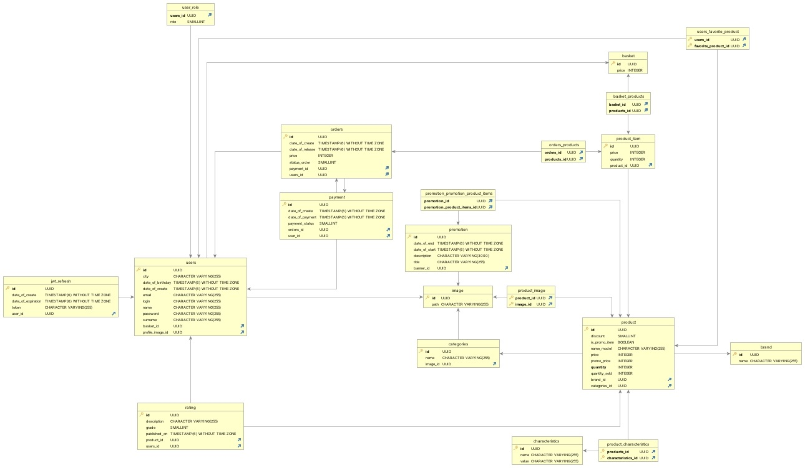

# OnlineMarket

Интернет магазин электроники.
Технлогии которые использовались при разработке -
<ul>
  <li>Java 17</li>
  <li>Spring boot (Web, JPA, Security)</li>
  <li>JWT</li>
  <li>PostgreSQL</li>
  <li>Docker</li>
  <li>Git</li>
  <li>HTML</li>
  <li>CSS</li>
  <li>Vue.js</li>
</ul>

<h2>
  Диаграмма базы данных
</h2>



# Сборка проекта

### Docker

```
docker-compose --env-file .config/.env build
```

### Стандартная

```
mvn clear package
```

# Docker

### Dockerfile для автоматической сборки проекта

```
FROM maven:3.8.4-openjdk-17 as builder
WORKDIR /app
COPY . /app/.
RUN mvn -f /app/pom.xml clean package

FROM amazoncorretto:17
ARG JAR_FILE=*.jar
COPY /target/${JAR_FILE} application.jar
ENTRYPOINT ["java", "-jar", "application.jar"]
```

### compose.yaml

```
version: '3.5'

  services:
    postgres:
      container_name: postgres_container
      image: postgres
      environment:
        POSTGRES_USER: ${POSTGRES_USER}
        POSTGRES_PASSWORD: ${POSTGRES_PASSWORD}
      PGDATA: /data/postgres
    volumes:
    - postgres:/data/postgres
    ports:
    - "5432:5432"
    networks:
    - postgres
    restart: unless-stopped
  
  pgadmin:
    container_name: pgadmin_container
    image: dpage/pgadmin4
    environment:
      PGADMIN_DEFAULT_EMAIL: ${PGADMIN_DEFAULT_EMAIL}
      PGADMIN_DEFAULT_PASSWORD: ${PGADMIN_DEFAULT_PASSWORD}
      PGADMIN_CONFIG_SERVER_MODE: 'False'
    volumes:
    - pgadmin:/var/lib/pgadmin
    ports:
    - "${PGADMIN_PORT:-5050}:80"
    networks:
    - postgres
    restart: unless-stopped
  
  spring-boot:
    environment:
      DB_PASSWORD: ${POSTGRES_PASSWORD}
      DB_USERNAME: ${POSTGRES_USER}
      JWT_KEY: ${JWT_KEY}
      DB_CONNECT: ${DB_CONNECT}
    image: spring-boot
    build:
      dockerfile: Dockerfile
    ports:
      - "8080:8080"
    networks:
      - postgres
    depends_on:
      - postgres
  
networks:
  postgres:
    driver: bridge

volumes:
  postgres:
  pgadmin:
  spring-boot:
```

# Структура проекта

```

+---entity      // Модели сущностей для базы данных, репозитории, ошибки
¦   +---exception // Глобальный ошибки
¦   +---image
¦   ¦   +---exception // Локальные ошибки для сущности
¦   ¦   +---gateway   // Репозитории
¦   ¦   L---model     // Модель сущности
¦   +---productPayload // Область продукта
¦   ¦   +---brand
¦   ¦   ¦   +---exception
¦   ¦   ¦   +---gateway
¦   ¦   ¦   L---model
¦   ¦   +---categories
¦   ¦   ¦   +---exception
¦   ¦   ¦   +---gateway
¦   ¦   ¦   L---model
¦   ¦   +---characteristics
¦   ¦   ¦   +---exception
¦   ¦   ¦   +---gateway
¦   ¦   ¦   L---model
¦   ¦   +---product
¦   ¦   ¦   +---exception
¦   ¦   ¦   +---gateway
¦   ¦   ¦   ¦   L---repo
¦   ¦   ¦   L---model
¦   ¦   +---promotion
¦   ¦   ¦   +---exception
¦   ¦   ¦   +---gateway
¦   ¦   ¦   L---model
¦   ¦   L---rating
¦   ¦       +---exception
¦   ¦       +---gateway
¦   ¦       L---model
¦   L---userPayload  // Область пользователя
¦       +---basket
¦       ¦   +---exception
¦       ¦   +---gateway
¦       ¦   L---model
¦       +---order
¦       ¦   +---exception
¦       ¦   +---gateway
¦       ¦   L---model
¦       L---user
¦           +---exception
¦           +---gateway
¦           ¦   +---mapper
¦           ¦   L---repository
¦           L---model
+---infastructure    // Сервисы, контролеры, DTO
¦   +---config
¦   ¦   +---exception
¦   ¦   L---web
¦   ¦       +---authentication
¦   ¦       ¦   +---controller
¦   ¦       ¦   +---dto
¦   ¦       ¦   L---gateway
¦   ¦       L---documentation
¦   +---image
¦   ¦   +---controller
¦   ¦   +---dto
¦   ¦   L---gateway
¦   +---productPayload
¦   ¦   +---brand
¦   ¦   ¦   +---controller
¦   ¦   ¦   +---dto
¦   ¦   ¦   L---gateway
¦   ¦   +---categories
¦   ¦   ¦   +---controller
¦   ¦   ¦   +---dto
¦   ¦   ¦   L---gateway
¦   ¦   +---characteristics
¦   ¦   ¦   +---controller
¦   ¦   ¦   +---dto
¦   ¦   ¦   L---gateway
¦   ¦   +---product
¦   ¦   ¦   +---controller
¦   ¦   ¦   +---dto
¦   ¦   ¦   L---gateway
¦   ¦   ¦       L---filter
¦   ¦   +---promotion
¦   ¦   ¦   +---controller
¦   ¦   ¦   +---dto
¦   ¦   ¦   L---gateway
¦   ¦   L---rating
¦   ¦       +---controller
¦   ¦       +---dto
¦   ¦       L---gateway
¦   L---userPayload
¦       +---basket
¦       ¦   +---controller
¦       ¦   +---dto
¦       ¦   L---gateway
¦       +---order
¦       ¦   +---controller
¦       ¦   +---dto
¦       ¦   L---gateway
¦       L---user
¦           +---controller
¦           +---dto
¦           L---gateway
L---usecase         // Реализация сервисов, логика.
    +---image
    +---productPayload
    ¦   +---brand
    ¦   +---categories
    ¦   +---characteristics
    ¦   +---product
    ¦   ¦   +---child
    ¦   ¦   L---filter
    ¦   +---promotion
    ¦   L---rating
    L---userPayload
        +---auth
        +---basket
        +---order
        L---user
            L---mapper
```
